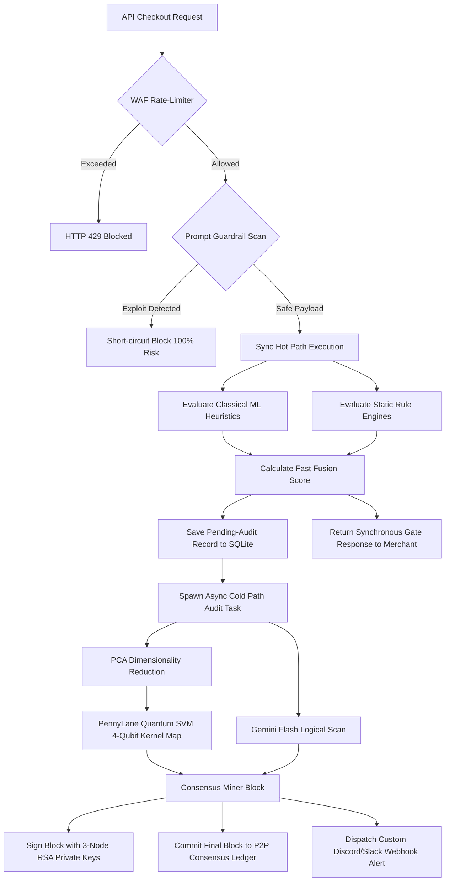

# System Architecture Guide — Neuro-QKAD (Track 02)

Welcome to the technical architecture guide for **Neuro-QKAD**, a production-ready, hybrid quantum-classical fraud detection gateway designed for high-throughput merchant checkout systems.

This document details the software design, predictive modeling engine, database consensus protocols, and API firewalls securing our system.

---

## 🗺️ Architectural Workflow Overview

The entire verification pipeline routes requests dynamically to guarantee sub-15ms checkout responses while executing computationally intensive QML (Quantum Machine Learning) and LLM (Large Language Model) models in the background.

---

## 🛠️ Deep Dive: Core Components

### 1. Dual-Path Zero-Latency Gateway
* **Hot Path (Synchronous, $\le 15$ms)**: Evaluates light heuristics and an XGBoost pre-classifier. It commits the transaction to the database with a state of `PENDING AUDIT` and immediately responds to the merchant checkout form.
* **Cold Path (Asynchronous, Background)**: Executes the expensive QML kernel evaluations (4-qubit Hilbert projection mapping) and Gemini prompt reasoning, updating the ledger record status to `BLOCK` or `APPROVE` and firing webhooks.

### 2. Hybrid Quantum-Classical Classifier (Neuro-QKAD)
* **Classical Pre-Processor**: Reduces standard transaction feature sets (amount, age, timing, etc.) to 4 core vectors using `IncrementalPCA` dimensionality reduction.
* **Quantum Feature Mapping**: Maps the 4 vectors into an angle-embedded quantum state on a 4-qubit simulated processor in PennyLane using a circuit configuration:
  $$|\psi(\mathbf{x})\rangle = \bigotimes_{j=1}^4 R_x(x_j)|0\rangle^{\otimes 4}$$
* **Meta-Fusion**: The final risk probability is computed as a weighted fusion score:
  $$\text{Fusion Score} = (\text{Quantum Score} \times 0.5) + (\text{Classical ML} \times 0.3) + (\text{Gemini Rules} \times 0.2)$$

### 3. False-Positive Cost Optimizer
* Minimizes merchant friction and fraud losses by finding the optimal action threshold $\theta$ using cost-weight matrices:
  $$\text{Total Cost}(\theta) = \sum \big(\text{False Positives}(\theta) \times C_{\text{friction}}\big) + \sum \big(\text{False Negatives}(\theta) \times C_{\text{fraud}}\big)$$

### 4. P2P Cryptographic Consensus Ledger
* Simulates distributed verification. Blocks are appended using a local sqlite blockchain audit trail.
* During block mining, hashes are signed by 3 validators (`node_primary`, `node_validator_1`, `node_validator_2`) using modular exponentiation cryptography (RSA emulation):
  $$\text{Signature} = S^d \pmod n$$
* Mined blocks are verified by peer nodes prior to commit:
  $$\text{Hash} = \text{Signature}^e \pmod n$$

### 5. API WAF Shield & LLM Prompt Guardrail
* **WAF Rate Limiter**: Implements a sliding-window tracker blocking velocity bursts exceeding configured request caps (2 - 25 req/s) with an HTTP 429 error.
* **LLM Guardrail Shield**: Intercepts checkout parameters (such as transaction notes) searching for adversarial injection prompts. When triggered, it bypasses LLM operations to prevent system manipulation and save API costs.
