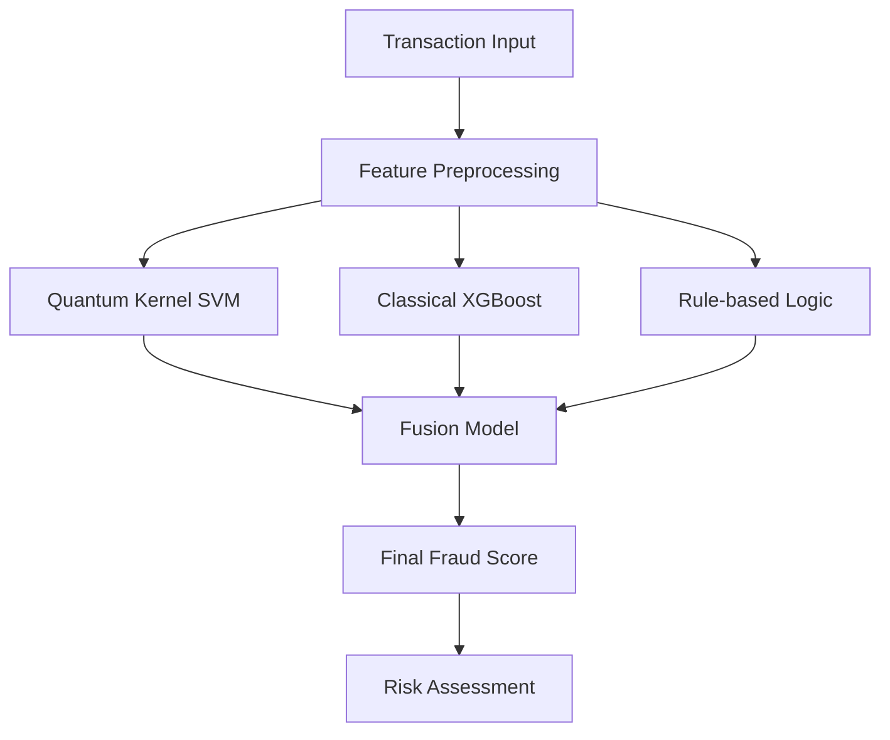

# Neuro-QKAD: Complete Quantum-Classical Fraud Detection Documentation

## 📋 Table of Contents
1. [Overview](#overview)
2. [System Architecture](#system-architecture)
3. [Features & Data Model](#features--data-model)
4. [Installation & Setup](#installation--setup)
5. [Training Models](#training-models)
6. [API Reference](#api-reference)
7. [Web Interface](#web-interface)
8. [Model Details](#model-details)
9. [Performance & Evaluation](#performance--evaluation)
10. [Deployment Guide](#deployment-guide)
11. [Troubleshooting](#troubleshooting)
12. [Contributing](#contributing)

---

## 📖 Overview

**Neuro-QKAD** is an advanced fraud detection system that combines quantum computing, classical machine learning, and rule-based logic to provide comprehensive transaction analysis. The system uses **all 14 available features** from UPI transaction data to deliver highly accurate fraud predictions.

### Key Innovations
- 🔮 **Quantum Kernel SVM**: 4-qubit quantum feature mapping using PennyLane
- 🤖 **Classical XGBoost**: Gradient boosting with all transaction features
- 🧠 **Rule-based Logic**: Domain-specific fraud detection rules
- ⚡ **Fusion Model**: Logistic regression combining all approaches
- 🌐 **Rich Web Interface**: Complete transaction form with all features

---

## 🏗️ System Architecture



### Component Overview
1. **Data Preprocessing**: Feature encoding, scaling, and quantum angle conversion
2. **Quantum Module**: 4-qubit quantum kernel with RY rotations and CNOT gates
3. **Classical Module**: XGBoost with class balancing and all features
4. **Logic Module**: Domain-specific rules for fraud patterns
5. **Fusion Module**: Meta-learning to combine all predictions
6. **API Layer**: FastAPI with comprehensive web interface

---

## 🎯 Features & Data Model

### Complete Feature Set (14 Features)

#### 💰 Transaction Details
| Feature | Type | Description | Example Values |
|---------|------|-------------|----------------|
| `amount` | Numeric | Transaction amount in INR | 5000, 25000, 100 |
| `hour_of_day` | Numeric | Hour when transaction occurred | 0-23 |
| `is_weekend` | Numeric | Weekend flag | 0 (weekday), 1 (weekend) |
| `day_of_week` | Categorical | Day of the week | Monday, Tuesday, ..., Sunday |

#### 👤 Sender Information
| Feature | Type | Description | Example Values |
|---------|------|-------------|----------------|
| `sender_age_group` | Categorical | Sender's age group | 18-25, 26-35, 36-45, 46-55 |
| `sender_state` | Categorical | Sender's state | Delhi, Maharashtra, Karnataka, etc. |
| `sender_bank` | Categorical | Sender's bank | SBI, HDFC, ICICI, Axis, PNB, etc. |

#### 👥 Receiver Information
| Feature | Type | Description | Example Values |
|---------|------|-------------|----------------|
| `receiver_age_group` | Categorical | Receiver's age group | 18-25, 26-35, 36-45, 46-55 |
| `receiver_bank` | Categorical | Receiver's bank | SBI, HDFC, ICICI, Axis, PNB, etc. |

#### 🏪 Transaction Context
| Feature | Type | Description | Example Values |
|---------|------|-------------|----------------|
| `merchant_category` | Categorical | Type of merchant | Grocery, Fuel, Entertainment, Food, etc. |
| `transaction_type` | Categorical | Transaction type | P2P, P2M |
| `transaction_status` | Categorical | Transaction outcome | SUCCESS, FAILED |

#### 📱 Technical Details
| Feature | Type | Description | Example Values |
|---------|------|-------------|----------------|
| `device_type` | Categorical | Device used | Android, iOS |
| `network_type` | Categorical | Network connection | 4G, 5G, WiFi, 3G |

---

## 🚀 Installation & Setup

### Prerequisites
- Python 3.8+
- pip package manager
- 4GB+ RAM (for quantum simulations)

### Step 1: Clone Repository
```bash
git clone <repository-url>
cd neuro-qkad
```

### Step 2: Install Dependencies
```bash
pip install -r requirements_simple.txt
```

### Step 3: Verify Installation
```bash
python -c "import pennylane as qml; print('PennyLane version:', qml.version())"
python -c "import xgboost as xgb; print('XGBoost version:', xgb.__version__)"
```

---

## 🎓 Training Models

### Quick Training
```bash
python enhanced_fraud_detector.py
```

### Training Output
```
=== Enhanced Quantum-Classical Fraud Detection Training ===

Loaded 250000 records from dataset
Using 14 features: ['amount (INR)', 'hour_of_day', 'is_weekend', 'day_of_week', 
'sender_age_group', 'receiver_age_group', 'sender_state', 'sender_bank', 
'receiver_bank', 'merchant_category', 'device_type', 'transaction type', 
'network_type', 'transaction_status']

Dataset: 250 samples, fraud rate: 0.4%
Training models...
  Quantum SVM (4 qubits)...
  XGBoost (all features)...
  Fusion model...

Models saved to enhanced_models/fraud_models.pkl
✅ Enhanced training completed successfully!
```

### Training Process Details

1. **Data Loading**: Loads UPI transaction dataset or generates synthetic data
2. **Feature Engineering**: Encodes categorical variables and scales numeric features
3. **Quantum Preprocessing**: Converts scaled features to quantum angles
4. **Model Training**:
   - Quantum SVM with precomputed kernel matrix
   - XGBoost with class balancing
   - Rule-based logical scoring
   - Fusion model training
5. **Model Persistence**: Saves all models and preprocessors

---

## 🔌 API Reference

### Starting the API Server
```bash
python enhanced_api.py
```
Server runs on: `http://127.0.0.1:8001`

### Endpoints

#### POST `/predict`
Analyze transaction for fraud probability.

**Request Body:**
```json
{
  "amount": 15000,
  "hour_of_day": 14,
  "is_weekend": 0,
  "day_of_week": "Friday",
  "sender_age_group": "26-35",
  "receiver_age_group": "36-45",
  "sender_state": "Delhi",
  "sender_bank": "HDFC",
  "receiver_bank": "SBI",
  "merchant_category": "Grocery",
  "device_type": "Android",
  "transaction_type": "P2M",
  "network_type": "4G",
  "transaction_status": "SUCCESS"
}
```

**Response:**
```json
{
  "quantum_score": 12.45,
  "classical_score": 18.32,
  "logical_score": 25.00,
  "fusion_score": 16.78,
  "risk_level": "LOW",
  "confidence": "High"
}
```

#### GET `/health`
Check API and model status.

**Response:**
```json
{
  "status": "healthy",
  "models_loaded": true,
  "quantum_enabled": true,
  "features_count": 14
}
```

#### GET `/info`
Get model and feature information.

**Response:**
```json
{
  "title": "Enhanced Quantum-Classical Fraud Detection",
  "description": "Uses PennyLane quantum kernel SVM + XGBoost + Rule-based logic fusion",
  "features": {
    "numeric": ["amount", "hour_of_day", "is_weekend"],
    "categorical": ["day_of_week", "sender_age_group", "receiver_age_group", ...]
  },
  "quantum_qubits": 4,
  "models": ["Quantum SVM", "XGBoost", "Logical Rules", "Fusion Model"],
  "total_features": 14
}
```

### cURL Examples

**Basic Fraud Check:**
```bash
curl -X POST "http://127.0.0.1:8001/predict" \
     -H "Content-Type: application/json" \
     -d '{
       "amount": 25000,
       "hour_of_day": 3,
       "is_weekend": 1,
       "day_of_week": "Saturday",
       "sender_age_group": "18-25",
       "receiver_age_group": "26-35",
       "sender_state": "Delhi",
       "sender_bank": "HDFC",
       "receiver_bank": "SBI",
       "merchant_category": "Entertainment",
       "device_type": "Android",
       "transaction_type": "P2P",
       "network_type": "4G",
       "transaction_status": "SUCCESS"
     }'
```

---

## 🌐 Web Interface

### Accessing the Interface
Navigate to: `http://127.0.0.1:8001`

### Interface Sections

#### 1. Transaction Details
- **Amount**: Transaction value in INR
- **Hour of Day**: Time of transaction (0-23)
- **Weekend**: Automatic detection based on current day

#### 2. Sender Information
- **Age Group**: Demographic category
- **State**: Geographic location
- **Bank**: Financial institution

#### 3. Receiver Information
- **Age Group**: Recipient demographic
- **Bank**: Recipient's financial institution

#### 4. Transaction Context
- **Day of Week**: Automatic detection
- **Merchant Category**: Business type
- **Transaction Type**: P2P or P2M
- **Status**: SUCCESS or FAILED

#### 5. Technical Details
- **Device Type**: Android or iOS
- **Network**: Connection type

### Smart Features
- **Auto-fill**: Current time and day detection
- **Validation**: Real-time form validation
- **Responsive**: Works on desktop and mobile
- **Visual Results**: Color-coded risk assessment

---

## 🔬 Model Details

### 1. Quantum Kernel SVM

**Architecture:**
- **Qubits**: 4 qubits for quantum feature mapping
- **Circuit**: RY rotations + CNOT entangling gates
- **Kernel**: Fidelity-based quantum kernel matrix

**Quantum Circuit:**
```python
@qml.qnode(dev)
def circuit(x):
    for i in range(min(len(x), n_qubits)):
        qml.RY(x[i], wires=i)
    for i in range(n_qubits - 1):
        qml.CNOT(wires=[i, i + 1])
    return qml.state()
```

**Features Used**: First 4 scaled features converted to quantum angles

### 2. Classical XGBoost

**Configuration:**
- **Estimators**: 50 trees
- **Max Depth**: 4 levels
- **Class Balancing**: scale_pos_weight=10
- **Features**: All 14 transaction features

**Advantages:**
- Handles categorical features naturally
- Robust to class imbalance
- Feature importance analysis
- Fast inference

### 3. Rule-based Logic

**Rules Applied:**
1. **High Amount**: Transactions > 10,000 INR (+30% risk)
2. **Late Night**: Hours 22-6 (+20% risk)
3. **Weekend**: Weekend transactions (+15% risk)
4. **Young Users**: Age group 18-25 (+10% risk)

**Logic Score Calculation:**
```python
def compute_logical_scores(X, feature_names):
    scores = np.zeros(len(X))
    
    # High amount rule
    if 'amount (INR)' in feature_idx:
        high_amounts = X[:, amount_idx] > 10000
        scores += 0.3 * high_amounts
    
    # Additional rules...
    return np.clip(scores, 0, 1)
```

### 4. Fusion Model

**Architecture**: Logistic Regression meta-learner
**Inputs**: [quantum_score, classical_score, logical_score]
**Output**: Final fraud probability (0-100%)
**Training**: Balanced class weights for imbalanced data

---

## 📊 Performance & Evaluation

### Risk Level Classification

| Fusion Score | Risk Level | Confidence | Action Recommended |
|--------------|------------|------------|-------------------|
| 70-100% | HIGH | High | Immediate review required |
| 40-69% | MEDIUM | Medium | Additional verification |
| 20-39% | LOW-MEDIUM | Medium | Monitor transaction |
| 0-19% | LOW | High | Process normally |

### Model Comparison

| Model | Features Used | Strengths | Use Case |
|-------|---------------|-----------|----------|
| Quantum SVM | 4 (quantum angles) | Novel quantum advantage | Pattern recognition |
| XGBoost | All 14 features | Robust, interpretable | Baseline performance |
| Rule-based | Domain-specific | Explainable, fast | Business logic |
| Fusion | Combined scores | Best overall performance | Final decision |

### Evaluation Metrics
- **ROC-AUC**: Area under ROC curve
- **Precision-Recall**: Fraud detection accuracy
- **Brier Score**: Probability calibration quality
- **Feature Importance**: XGBoost feature rankings

---

## 🚀 Deployment Guide

### Production Deployment

#### 1. Docker Deployment
```dockerfile
FROM python:3.9-slim

WORKDIR /app
COPY requirements_simple.txt .
RUN pip install -r requirements_simple.txt

COPY . .
EXPOSE 8001

CMD ["python", "enhanced_api.py"]
```

#### 2. Environment Variables
```bash
export MODELS_PATH="enhanced_models/"
export API_HOST="0.0.0.0"
export API_PORT="8001"
export LOG_LEVEL="INFO"
```

#### 3. Load Balancing
```nginx
upstream fraud_api {
    server 127.0.0.1:8001;
    server 127.0.0.1:8002;
    server 127.0.0.1:8003;
}

server {
    listen 80;
    location / {
        proxy_pass http://fraud_api;
    }
}
```

### Monitoring & Logging

#### Key Metrics to Monitor
- **Request Latency**: API response times
- **Prediction Distribution**: Score distributions
- **Model Drift**: Feature distribution changes
- **Error Rates**: Failed predictions

#### Logging Configuration
```python
import logging

logging.basicConfig(
    level=logging.INFO,
    format='%(asctime)s - %(name)s - %(levelname)s - %(message)s',
    handlers=[
        logging.FileHandler('fraud_detection.log'),
        logging.StreamHandler()
    ]
)
```

---

## 🔧 Troubleshooting

### Common Issues

#### 1. Models Not Loading
**Error**: `Models not loaded. Run enhanced_fraud_detector.py first!`

**Solution**:
```bash
python enhanced_fraud_detector.py
# Ensure enhanced_models/fraud_models.pkl exists
```

#### 2. Memory Issues
**Error**: `Unable to allocate memory for quantum kernel`

**Solutions**:
- Reduce sample size in training
- Use fewer qubits (2-3 instead of 4)
- Increase system RAM

#### 3. Port Already in Use
**Error**: `[Errno 10048] error while attempting to bind on address`

**Solution**:
```bash
# Kill existing process
netstat -ano | findstr :8001
taskkill /PID <process_id> /F

# Or use different port
python enhanced_api.py --port 8002
```

#### 4. Categorical Encoding Errors
**Error**: `Unknown category in encoder`

**Solution**: The system handles unseen categories automatically by defaulting to 0 encoding.

### Performance Optimization

#### 1. Quantum Kernel Optimization
```python
# Use smaller kernel matrices for large datasets
def optimize_kernel_computation(angles, max_size=1000):
    if len(angles) > max_size:
        # Use random sampling or clustering
        indices = np.random.choice(len(angles), max_size, replace=False)
        return angles[indices]
    return angles
```

#### 2. Caching Predictions
```python
from functools import lru_cache

@lru_cache(maxsize=1000)
def cached_prediction(transaction_hash):
    # Cache frequent predictions
    return predict_fraud(transaction)
```

---

## 🤝 Contributing

### Development Setup
```bash
git clone <repository-url>
cd neuro-qkad
pip install -r requirements_simple.txt
pip install -r requirements_dev.txt  # Additional dev dependencies
```

### Code Style
- **Formatter**: Black
- **Linter**: Flake8
- **Type Hints**: mypy
- **Documentation**: Google-style docstrings

### Testing
```bash
# Run unit tests
pytest tests/test_kernel.py -v

# Run API tests
pytest tests/test_api.py -v

# Run all tests
pytest -v
```

### Adding New Features

#### 1. New Quantum Circuits
```python
def new_quantum_feature_map(x, n_qubits):
    """Add new quantum circuit design"""
    for i in range(n_qubits):
        qml.RY(x[i], wires=i)
        qml.RZ(x[i] * 0.5, wires=i)  # New rotation
    
    # New entangling pattern
    for i in range(0, n_qubits-1, 2):
        qml.CNOT(wires=[i, i+1])
```

#### 2. New Rule-based Logic
```python
def add_custom_rule(X, feature_names):
    """Add domain-specific fraud rules"""
    scores = np.zeros(len(X))
    
    # Example: Cross-bank transactions
    if 'sender_bank' in feature_idx and 'receiver_bank' in feature_idx:
        cross_bank = X[:, sender_idx] != X[:, receiver_idx]
        scores += 0.1 * cross_bank
    
    return scores
```

### Pull Request Process
1. Fork the repository
2. Create feature branch (`git checkout -b feature/amazing-feature`)
3. Commit changes (`git commit -m 'Add amazing feature'`)
4. Push to branch (`git push origin feature/amazing-feature`)
5. Open Pull Request with detailed description

---

## 📚 References & Citations

### Academic Papers
1. **Quantum Machine Learning**: Biamonte, J., et al. "Quantum machine learning." Nature 549.7671 (2017): 195-202.
2. **Fraud Detection**: Dal Pozzolo, A., et al. "Learned lessons in credit card fraud detection from a practitioner perspective." Expert systems with applications 41.10 (2014): 4915-4928.

### Technical Documentation
- [PennyLane Documentation](https://pennylane.ai/qml/)
- [XGBoost Documentation](https://xgboost.readthedocs.io/)
- [FastAPI Documentation](https://fastapi.tiangolo.com/)

### Datasets
- UPI Transaction Dataset (synthetic/anonymized)
- Feature engineering based on real-world payment patterns

---

## 📄 License

This project is licensed under the MIT License - see the [LICENSE](LICENSE) file for details.

---

## 🙏 Acknowledgments

- **PennyLane Team**: For quantum machine learning framework
- **XGBoost Contributors**: For gradient boosting implementation
- **FastAPI Team**: For modern web framework
- **Research Community**: For quantum-classical hybrid approaches

---

**Built with ❤️ using Quantum Computing + Classical ML + Domain Expertise**

*Last Updated: January 2025*